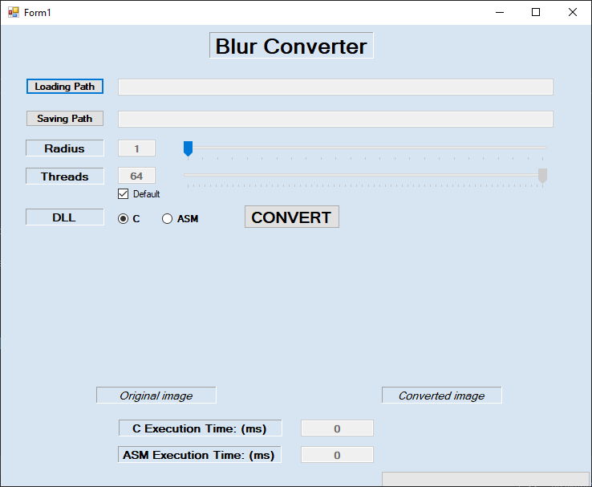

# BlurConverter

## Overview

Application applies blur effect on image. Project uses box blur algorithm which is being count for every pixel in image. Calculated value is a simple average of all pixels that surround current pixel. In this implementation processing average in a row of pixels is performed using provided libraries in asembler and C.

## Prerequisites

* [Visual Studio](https://visualstudio.microsoft.com/pl/) - IDE for development
* [.NET Framework](https://dotnet.microsoft.com/download/dotnet-framework) (last checked version was 4.8)

## Installation

1. Clone this repository
2. Open project in Visual Studio.
3. There are three projects included: assembler, C and C#. Rebuild project and run it.

## Usage

Clicking `Loading Path` opens window for selecting an image. After choosing it automatically fills `Saving Path` so there is no need to set it manually.
`Radius` is an intensity of blur. `Threads` count are set by default to 64 but can we selected between 1 and 64. User can choose which library should be used as a core algorithm - either the one implemented in C or in assembler. CLicking `Convert` performs application of blur to the source image and saves a result to the target image.

## Development

Solution consists of 3 separate projects: libraries written in C and assembler and main program in C#. Each rebuild copies generated libraries to main project.
